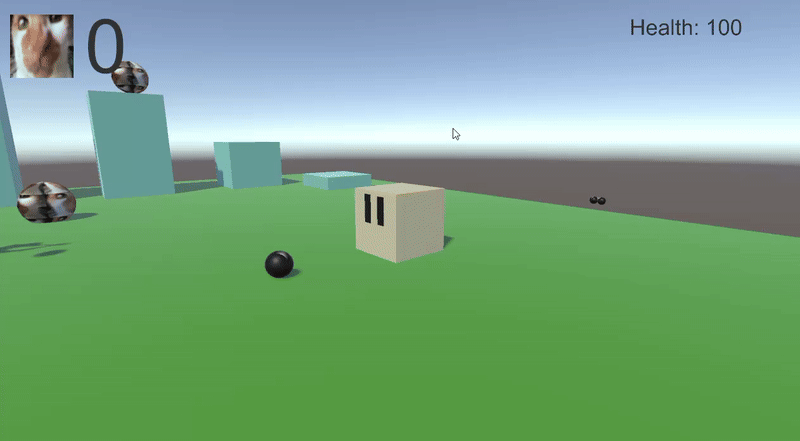

## Tutorial 5,6;

Code:

https://github.com/Adem-ma/M3-Unity-Tutorials/blob/main/Assets/EnemyHit.cs

https://github.com/Adem-ma/M3-Unity-Tutorials/blob/main/Assets/Explotion.cs

https://github.com/Adem-ma/M3-Unity-Tutorials/blob/main/Assets/PlayerHealth.cs

https://github.com/Adem-ma/M3-Unity-Tutorials/blob/main/Assets/shoot.cs

Showcase:

